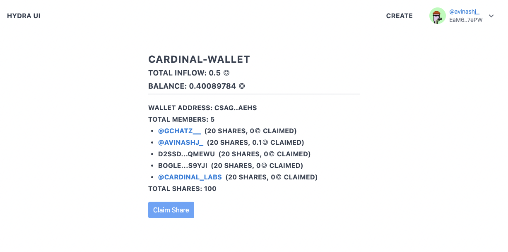

## Overview

This is an open UI for Remetadat00r, a protocol on Solana for facilitating collective account pooling, fan out wallet and dao treasury. It can be thought of as a group-owned wallet that can accept funds. Unlike a multi-signature wallet, this is meant to collect and distribute funds, not execute group transactions. More information on the protocol can be found a https://github.com/GlassEaters/remetadat00r.

| Package   | Description                 | Version                              |
| :-------- | :-------------------------- | :----------------------------------- |
| `Devnet`  | Devnet ui for Remetadat00r  | https://dev-remetadat00r.cardinal.so |
| `Mainnet` | Mainnet ui for Remetadat00r | https://remetadat00r.cardinal.so     |

<p align="center">
    
</p>

## Getting Started

```bash
git clone https://github.com/cardinal-labs/remetadat00r-ui.git
yarn dev
```

Open [http://localhost:3000](http://localhost:3000) with your browser to see the result.

You can start editing the page by modifying `pages/index.tsx`. The page auto-updates as you edit the file.

## Deployments

All commits to main branch will be automatically deployed to production and dev URLs. Open PRs to main will deploy ephemeral preview deployments.

## Contributing

Feel free to open a PR against main. Forks are encouraged as well
